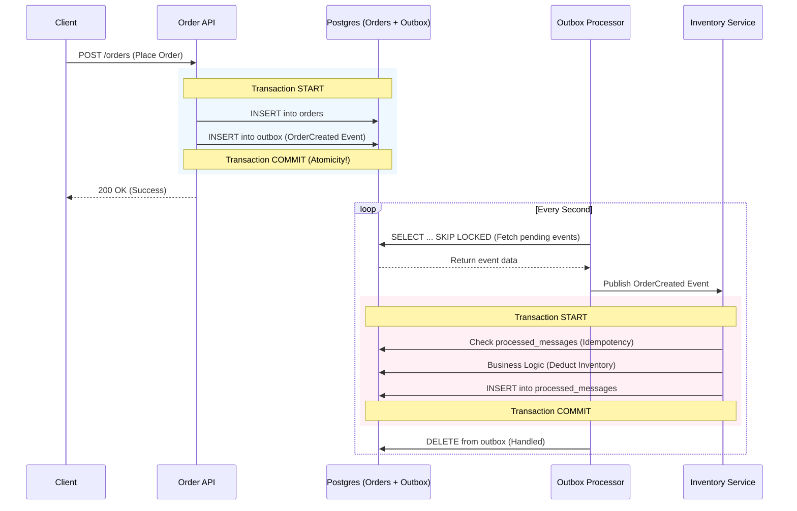

# Transactional Outbox Pattern Example

[中文版 (Chinese Version)](README_zh.md)

## System Architecture

### 🏗️ System Flow (Sequence Diagram)



---

## 🔍 Core Mechanisms

### 1. Atomic Write
Ensures "Order Creation" and "Event Notification" are bound. Uses a single DB Transaction to write to both `orders` and `outbox` tables, solving the Dual Write problem.

### 2. High Concurrency Background Processing (Worker Pool)
Launches 5 concurrent `OutboxProcessor` (via Goroutines). Utilizes SQL `FOR UPDATE SKIP LOCKED` to allow multiple workers to process messages in parallel without race conditions.

### 3. Idempotency & Status Synchronization
The downstream Consumer (Inventory Service) checks the `processed_messages` table before processing, ensuring business logic executes exactly once even if a message is received multiple times. Upon success, it updates the corresponding order status to `COMPLETED`.

---

## Quick Start

### 1. Start the Database
```bash
docker-compose up -d
```
*Note: PostgreSQL is mapped to port `5433`.*

### 2. Start the API Server
```bash
go run cmd/server/main.go
```

### 3. Concurrency Stress Test
```bash
go run cmd/stress_test/main.go
```
Sends 50 simultaneous requests. Observe server logs to see how `[Worker-1]` through `[Worker-5]` share the workload.

### 4. Verify Final Status
After running the stress test, verify that orders have moved from `PENDING` to `COMPLETED`:
```bash
docker exec outbox_postgres psql -U user -d outbox_db -c "SELECT status, count(*) FROM orders GROUP BY status;"
```

### 5. Verify Idempotency (Replay)
```bash
go run cmd/replay/main.go
```
Tests duplicate Message IDs and observes "SKIPPING" behavior in the consumer.

---

## 📂 Project Layout (Standard Go Layout)

This project follows the [golang-standards/project-layout](https://github.com/golang-standards/project-layout) convention:
- **`cmd/`**: Entry points. Each subdirectory corresponds to a binary.
- **`internal/`**: Private code. Go restricts access from other projects, ensuring encapsulation.
- **`internal/usecase/`**: Service Layer, where core transactional operations live.
- **`internal/worker/` & `internal/consumer/`**: Infrastructure Layer, handling concurrency and consumption.

---

## 🍣 Business Behavior (The Metaphor)

Imagine a **busy Sushi delivery shop**:
1. **The Counter (Atomicity)**: The clerk writes an "Order" and a "Memo (Event)" simultaneously. Both must be filed together, or neither exists.
2. **Delivery Workers (Worker Pool)**: 5 workers check the counter. The rule is: "If someone is already touching a memo, skip it (SKIP LOCKED)." This allows everyone to work in parallel.
3. **The Warehouse (Idempotency)**: The manager keeps a "Processed ID Log." If a worker delivers the same memo twice, the manager ignores the second one after checking the log.

