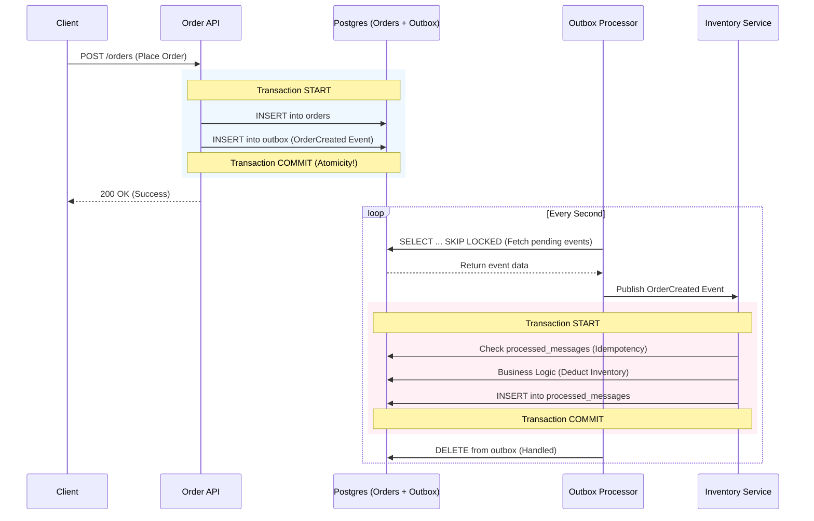

# Transactional Outbox Pattern Example

[中文版 (Chinese Version)](README_zh.md)

## System Architecture

### 🏗️ System Flow (Sequence Diagram)



---

## 🔍 Core Mechanisms

### 1. Atomic Write
Ensures "Order Creation" and "Event Notification" are bound. Uses a single DB Transaction to write to both `orders` and `outbox` tables, solving the Dual Write problem.

### 2. High Concurrency Background Processing (Worker Pool)
Launches 5 concurrent `OutboxProcessor` (via Goroutines). Utilizes SQL `FOR UPDATE SKIP LOCKED` to allow multiple workers to process messages in parallel without race conditions.

### 3. Idempotency Guarantee
The downstream Consumer (Inventory Service) checks the `processed_messages` table before processing, ensuring business logic executes exactly once even if a message is received multiple times due to network retries.

---

## Quick Start

### 1. Start the Database
```bash
docker-compose up -d
```
*Note: PostgreSQL is mapped to port `5433`.*

### 2. Start the API Server
```bash
go run cmd/server/main.go
```

### 3. Concurrency Stress Test
```bash
go run cmd/stress_test/main.go
```
Sends 50 simultaneous requests. Observe server logs to see how `[Worker-1]` through `[Worker-5]` share the workload.

### 4. Verify Idempotency (Replay)
```bash
go run cmd/replay/main.go
```
Tests duplicate Message IDs and observes "SKIPPING" behavior in the consumer.

---

## Project Structure
- `cmd/server`: Main API & Worker pool entry point.
- `cmd/stress_test`: Concurrency testing tool.
- `internal/usecase`: Core atomic transaction logic.
- `internal/worker`: SKIP LOCKED background polling.
- `internal/consumer`: Idempotency logic.
- `migrations`: SQL Schema definitions.

