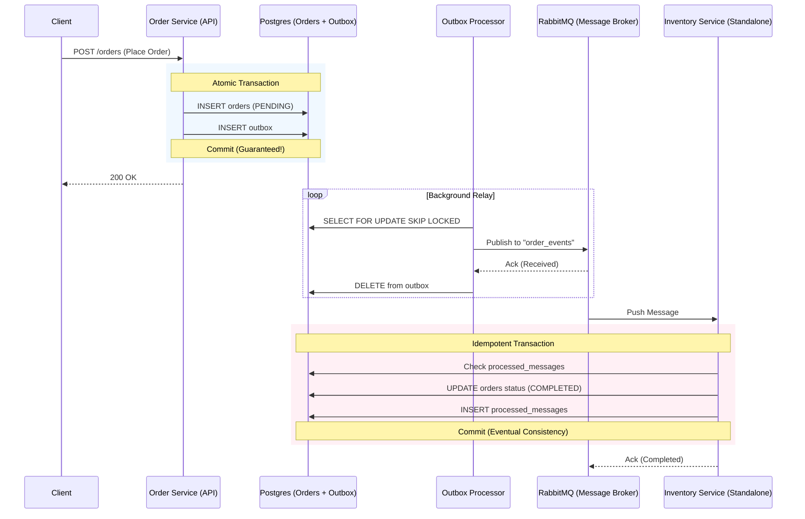

# Transactional Outbox Pattern Example

[中文版 (Chinese Version)](README_zh.md)

## System Architecture

### 🏗️ System Flow (Distributed Architecture)



---

## 🔍 Core Mechanisms

### 1. Atomic Write
Ensures "Order Creation" and "Event Notification" are bound. Uses a single DB Transaction to write to both `orders` and `outbox` tables, solving the Dual Write problem.

### 2. High Concurrency Background Processing (Worker Pool)
Launches 5 concurrent `OutboxProcessor` (via Goroutines). Utilizes SQL `FOR UPDATE SKIP LOCKED` to allow multiple workers to process messages in parallel without race conditions.

### 3. Decoupling & Reliable Delivery (RabbitMQ)
Introduces a real message broker. The Order Service only moves messages to MQ and doesn't wait for downstreams. This enables **load leveling** and **fault tolerance**—if a consumer is down, messages wait safely in the queue.

### 4. Idempotency & Status Synchronization
The downstream Consumer checks the `processed_messages` table before processing, ensuring logic executes exactly once. Upon success, it updates the order status to `COMPLETED`.

---

## Quick Start

### 1. Start Infrastructure
```bash
docker-compose up -d
```
*Starts PostgreSQL (5433) and RabbitMQ (5672/15672).*

### 2. Start API Server & Relay
```bash
go run cmd/server/main.go
```

### 3. Start Standalone Consumer (Separate Microservice)
```bash
go run cmd/worker_consumer/main.go
```

### 4. Stress Test & Observation
```bash
go run cmd/stress_test/main.go
```
Observe how the server publishes to RabbitMQ and how the consumer handles messages asynchronously.

### 5. Verify Final Status
```bash
docker exec outbox_postgres psql -U user -d outbox_db -c "SELECT status, count(*) FROM orders GROUP BY status;"
```

---

## 📂 Project Layout (Standard Go Layout)

This project follows the [golang-standards/project-layout](https://github.com/golang-standards/project-layout) convention:
- **`cmd/server`**: API & Outbox Worker entry point.
- **`cmd/worker_consumer`**: Standalone consumer (RabbitMQ listener).
- **`internal/worker`**: RabbitMQ Publisher implementation and relay logic.
- **`internal/usecase`**: Core atomic transaction logic.

---

## 🍣 Business Behavior (The Metaphor)

Imagine a **busy Sushi delivery shop**:
1. **The Counter (Atomicity)**: The clerk writes an "Order" and a "Memo" simultaneously. Both must be filed together, or neither exists.
2. **Delivery Workers (Worker Pool)**: 5 workers check the counter. The rule is: "If someone is already touching a memo, skip it." They take memos to the **Post Office (RabbitMQ)**.
3. **The Post Office (Message Queue)**: Guaranteed delivery. Even if the warehouse is closed today, the memo waits in the mailbox.
4. **The Warehouse (Idempotency)**: The manager checks a "Processed Log" before picking items. If the same memo arrives twice, it's ignored.

