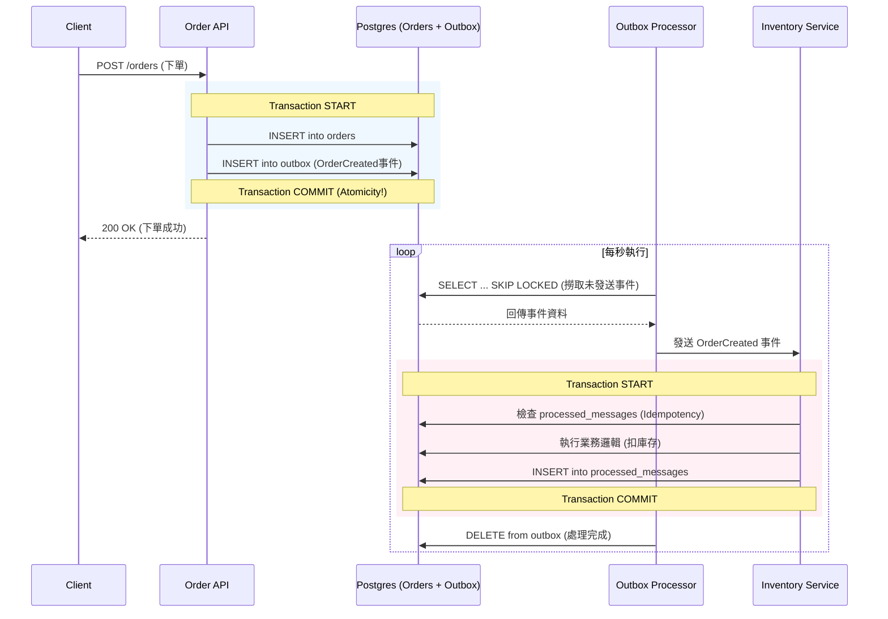

# Transactional Outbox Pattern Example

[English Version](README.md)

## 運作流程與架構

### 🏗️ 系統全景圖 (Sequence Diagram)



---

## 🔍 核心機制拆解

### 1. 原子性寫入 (Atomic Write)
確保「訂單建立」與「事件通知」兩者綁定。使用 DB Transaction 同步寫入 `orders` 與 `outbox` 表，解決 Dual Write 問題。

### 2. 高併發背景處理 (Worker Pool)
專案啟動了 5 個 `OutboxProcessor` (透過 Goroutines)。利用 SQL `FOR UPDATE SKIP LOCKED` 讓多個 Worker 可以平行處理訊息而不產生競態條件 (Race Condition)。

### 3. 冪等性保障 (Idempotency)
下游 Consumer (Inventory Service) 在處理前會先檢查 `processed_messages` 表，確保即使因為網落延遲導致重複收到同一則訊息，業務邏輯也只會執行一次。

---

## 快速開始

### 1. 啟動資料庫
```bash
docker-compose up -d
```
*注意：PostgreSQL 映射至 `5433` port。*

### 2. 啟動 API Server
```bash
go run cmd/server/main.go
```

### 3. 壓力測試與高併發觀察
```bash
go run cmd/stress_test/main.go
```
送出 50 筆請求後，觀察 Server Log 中 `[Worker-1]` 到 `[Worker-5]` 如何分工處理。

### 4. 驗證冪等性 (Replay)
```bash
go run cmd/replay/main.go
```
測試重複 Message ID，觀察 Consumer 的 "SKIPPING" 行為。

---

## 專案結構
- `cmd/server`: 主程式與 Worker 池引發。
- `cmd/stress_test`: 併發壓測工具。
- `internal/usecase`: 核心原子性事務邏輯。
- `internal/worker`: SKIP LOCKED 背景輪詢邏輯。
- `internal/consumer`: 冪等性檢查。
- `migrations`: SQL Schema 定義。

