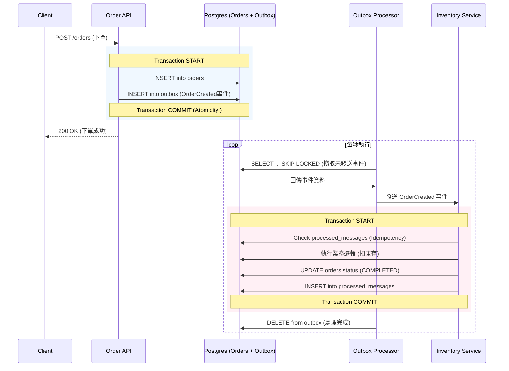

# Transactional Outbox Pattern Example

[English Version](README.md)

## 運作流程與架構

### 🏗️ 系統全景圖 (Sequence Diagram)



---

## 🔍 核心機制拆解

### 1. 原子性寫入 (Atomic Write)
確保「訂單建立」與「事件通知」兩者綁定。使用 DB Transaction 同步寫入 `orders` 與 `outbox` 表，解決 Dual Write 問題。

### 2. 高併發背景處理 (Worker Pool)
專案啟動了 5 個 `OutboxProcessor` (透過 Goroutines)。利用 SQL `FOR UPDATE SKIP LOCKED` 讓多個 Worker 可以平行處理訊息而不產生競態條件 (Race Condition)。

### 3. 冪等性保障與狀態回流 (Idempotency & Status Sync)
下游 Consumer (Inventory Service) 在處理前會先檢查 `processed_messages` 表，確保即使因為網路延遲導致重複收到同一則訊息，業務邏輯也只會執行一次。處理成功後，會同步將 `orders` 表的狀態更新為 `COMPLETED`。

---

## 快速開始

### 1. 啟動資料庫
```bash
docker-compose up -d
```
*注意：PostgreSQL 映射至 `5433` port。*

### 2. 啟動 API Server
```bash
go run cmd/server/main.go
```

### 3. 壓力測試與高併發觀察
```bash
go run cmd/stress_test/main.go
```
送出 50 筆請求後，觀察 Server Log 中 `[Worker-1]` 到 `[Worker-5]` 如何分工處理。

### 4. 驗證最終狀態
執行完壓測後，可以直接進資料庫確認訂單是否從 `PENDING` 轉為 `COMPLETED`：
```bash
docker exec outbox_postgres psql -U user -d outbox_db -c "SELECT status, count(*) FROM orders GROUP BY status;"
```

### 5. 驗證冪等性 (Replay)
```bash
go run cmd/replay/main.go
```
測試重複 Message ID，觀察 Consumer 的 "SKIPPING" 行為。

---

## 📂 專案架構 (Standard Go Layout)

本專案遵循 [golang-standards/project-layout](https://github.com/golang-standards/project-layout) 規範：
- **`cmd/`**: 程式進入點。每個子目錄代表一個可執行檔。
- **`internal/`**: 私有程式碼。Go 強制限制外部專案無法引用，確保業務邏輯的封裝與安全。
- **`internal/usecase/`**: 業務邏輯層 (Service Layer)，存放核心 Transactional 作業。
- **`internal/worker/` & `internal/consumer/`**: 基礎建設層，處理並行任務與下游接收。

---

## 🍣 商業行為模擬 (The Metaphor)

想像這是一家**超熱門的壽司外送店**：
1. **櫃檯收單 (Atomicity)**: 店員同時寫下「訂單」與「便條紙(事件)」。這兩者必須同時放進抽屜，否則就不成立。
2. **小外送員 (Worker Pool)**: 店裡請了 5 個外送員。規矩是「有人手按著的便條紙你就直接跳過 (SKIP LOCKED)」，這樣大家能分工最快地送貨。
3. **冷靜的倉管 (Idempotency)**: 倉庫管理員有一份「已處理 ID 登記簿」。即使外送員因為迷路送了兩次同樣的便條，管理員查完登記簿也會直接請他回去，不會重複扣貨。

