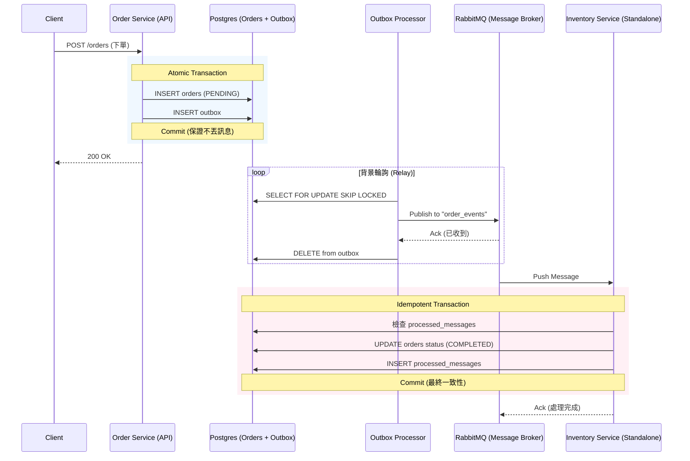

# Transactional Outbox Pattern Example

[English Version](README.md)

## 運作流程與架構

### 🏗️ 系統全景圖 (Distributed Architecture)



---

## 🔍 核心機制拆解

### 1. 原子性寫入 (Atomic Write)
確保「訂單建立」與「事件通知」兩者綁定。使用 DB Transaction 同步寫入 `orders` 與 `outbox` 表，解決 Dual Write 問題。

### 2. 高併發背景處理 (Worker Pool)
專案啟動了 5 個 `OutboxProcessor` (透過 Goroutines)。利用 SQL `FOR UPDATE SKIP LOCKED` 讓多個 Worker 可以平行處理訊息而不產生競態條件 (Race Condition)。

### 3. 解耦與可靠傳輸 (RabbitMQ)
引入真正的 Message Queue (RabbitMQ) 作為中介。Order Service 只負責將訊息搬運到 MQ，不需等待下游回應。即使下游服務暫時斷線，訊息也會安全地存放在 Queue 中，實現**削峰填谷**與**最終一致性**。

### 4. 冪等性保障與狀態回流 (Idempotency)
下游 Consumer 在處理前會先檢查 `processed_messages` 表，確保即使因為網路延遲導致重複收到同一則訊息，業務邏輯也只會執行一次。處理成功後，會同步將 `orders` 表的狀態更新為 `COMPLETED`。

---

## 快速開始

### 1. 啟動基礎設施
```bash
docker-compose up -d
```
*啟動 PostgreSQL (5433) 與 RabbitMQ (5672/15672)。*

### 2. 啟動 API Server & Relay
```bash
go run cmd/server/main.go
```

### 3. 啟動獨立 Consumer (模擬另一個微服務)
```bash
go run cmd/worker_consumer/main.go
```

### 4. 壓力測試與觀察
```bash
go run cmd/stress_test/main.go
```
送出 50 筆請求後，觀察 Server 如何發送訊息到 RabbitMQ，以及 Consumer 如何從 MQ 領取並處理。

### 5. 驗證最終狀態
```bash
docker exec outbox_postgres psql -U user -d outbox_db -c "SELECT status, count(*) FROM orders GROUP BY status;"
```

---

## 📂 專案架構 (Standard Go Layout)

本專案遵循 [golang-standards/project-layout](https://github.com/golang-standards/project-layout) 規範：
- **`cmd/server`**: API 與 Outbox Worker 進入點。
- **`cmd/worker_consumer`**: 獨立的消費者程序 (RabbitMQ 監聽者)。
- **`internal/worker`**: 包含 RabbitMQ Publisher 實作與編排邏輯。
- **`internal/usecase`**: 核心原子性事務邏輯。

---

## 🍣 商業行為模擬 (The Metaphor)

想像這是一家**超熱門的壽司外送店**：
1. **櫃檯收單 (Atomicity)**: 店員同時寫下「訂單」與「便條紙」。這兩者必須同時放進抽屜，否則就不成立。
2. **小外送員 (Worker Pool)**: 店裡請了 5 個外送員。規矩是「有人手按著的便條紙你就直接跳過」，大家分工把便條紙投進**郵筒 (RabbitMQ)**。
3. **郵差與分揀 (Message Queue)**: 郵筒保證訊息不會丟，即使倉庫今天休假，紙條也會在那等著。
4. **冷靜的倉管 (Idempotency)**: 倉庫管理員拿紙條領貨前會查「已領取登記簿」。如果收到兩張一樣的紙條，看完登記簿也會直接退回，不會給兩次貨。

